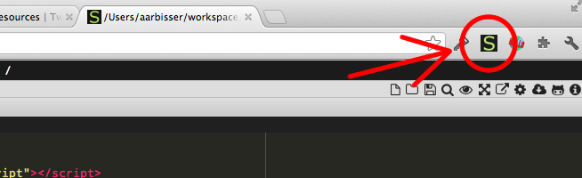
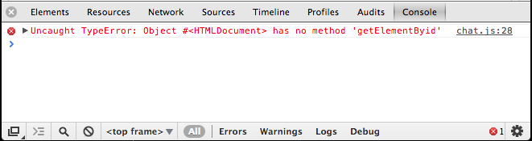
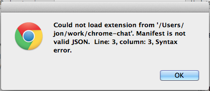
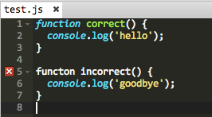

# Introduction

During this bootcamp, you will be creating applications and extensions for
Google Chrome. We want everyone to leave this bootcamp with a Google Chrome app
that they created.

If you have never written a line of codein your life, that's OK. We will give
you all the code you need on printed project packets. You just need to copy the
code exactly as it is written into the computer. As you do this, you are bound
to make mistakes. We hope that as you fix your mistakes, you will also learn
about coding.

As you are going, try to think of ways you can customize the projects. For
example, you can change the colors and the styling. Or you can combine features
from multiple projects into one. Be as creative as you'd like!

We would like to encourage everyone to work together and help each other as
much as possible. Learning to code is difficult, but it is much easier when
you work together.

We would also like to encourage everyone to research online. There is a wealth
of information available online for all the topics we will be covering. Here are
a few helpful sites, but feel free to google for more.

 * www.stackoverflow.com
 * developer.mozilla.org
 * www.w3schools.com
 * www.codecademy.com

# Hello World

In this project, you will first get set up with your development environment. We will be building Chrome extensions and applications, so you will need to download and install the Google Chrome browser if you do not already have it. You'll also need a way to write, save, and edit text files.

Your first extension is a Hello World Chrome extension that responds to the browser-action of clicking an icon by displaying a pop-up that says "Hello, world!"

## Core Concepts

  * Installing Chrome
  * Finding a text editor
  * HTML
  * Installing a Chrome Extension

## Getting Started

First, download and install Chrome Web Browser from here: https://www.google.com/intl/en/chrome/browser/.

If you have a text editor of choice, feel free to use it. If not, we recommend the Slim Text Chrome Application, which you can get here: http://slimtext.org/. (NOTE: Along with syntax highlighting, Slim Text will also match parentheses and brackets for you.)

In the rest of this packet, we will provide you with the necessary text files for your first Chrome extensions. 

1. Create a folder on your computer called hello_world.
2. For each of the files below, create a new file in your text editor. 
3. To do this in Slimtext, first open the application by clicking the green-S icon in the top right of your Chrome Browser. 



4. Navigate to the folder you created by clicking through the files on the left and directories above. 
5. Then open a new file by clicking the page-with-a-corner-folded-down icon, the left-most icon at the top right. 

Be sure to name the files as they appear below. Rember to save your files (NOTE: an asterisk by the file name means your changes have not been saved)!

## Source Files

*manifest.json*

Every Chrome extension has a manifest file. It tells Chrome which files provide the content and behavior of the extension. In this manifest file, we are telling Chrome to perform a "browser_action." In this case, the "default_popup" item specifies that a pop-up displaying the contents of hello.html should appear.

```javascript
{
  "manifest_version": 2,

  "name": "Hello World",
  "description": "This extension demonstrates a browser action.",
  "version": "1.0",

  "browser_action": {
    "default_popup": "hello.html"
  }
}
```

*hello.html*

This file describes what our popup will look like.

```html
<!DOCTYPE html>
<html>
  <!-- This is an HTML comment. You do not need to type these. -->
  <head>
    <!-- This block describes the style of the body. -->
    <style>
      body {
        min-width: 357px;
        overflow-x: hidden;
      }
    </style>
  </head>
  <!-- This block contains the primary content of the page. -->
  <body>
    <h1 style="color:black">Hello, world!</h1>
  </body>
</html>
```

## Running your Chrome extension

To run your Chrome extension, 

1. Go to chrome://extensions in your Chrome browser. 
2. Click the checkbox next to "Developer mode" in the top right
3. Then click “Load unpacked extension...” button. 
4. Select the folder that your manifest and html files are in. 

You should see your extension appear in the list of extensions below.

If you see a pop-up with an error message, it propably means that you mis-typed something in one of the files. See if you can figure out what you did wrong by reading the error message. Once you think you've fixed the problem, click the checkbox next to "Enable" near your extension and then click "Reload." Don't hesitate to ask for help if you get stuck. To ask for help, you can put your name in THIS QUEUE and a volunteer will come find you.

Once your extension is installed successfully, you should see a puzzle-piece icon in the top right of your Chrome browser. Click it!

## See what you can do!

  - Say "Hello, [your name]!" instead of "Hello, world!"
  - Change the color of the text.

# Help! I'm stuck!

As you are doing your projects, you are bound to spend a lot of time fixing mistakes in your code. This is normal. This guide is an introduction to spotting and fixing mistakes.

## Fixing errors

If there is something going wrong with your code, Chrome will try to tell you by printing our errors and warnings. If you know where to look, these can be very helpful.

### Javascript Console

Chrome has a Javascript console where errors and warnings are displayed. You can access it through the menu options:

  View -> Developer -> Javascript Console

This is an example of what an error looks like the Javascript console:



The console is reporting that there is an error in chat.js on line 28. The error is that we are trying to call a function called `getElementByid`, but the correct name of the function is `getElementById`. Notice that the I didn't capitalize the 'i' in Id correctly. Javascript is sensitive to capitalization, and this is what is causing the error.

### Line numbers

Usually an error will contain a relevant line number and file name. Usually the error will be on this line, but not always. Sometimes an error in an earlier piece of your code will trigger an error in a later part. For example, I received this error when trying to load my Chrome extension.



and here is the beginning of my manifest:

``` javascript
{
  "name": "My Chat Room"
  "description": "This app lets you chat with other people.",
  "version": "1.0",
```

The end of each definition in the manifest file needs to end with a comma. Notice that I forgot a comma on line 2. This is the cause of the error, even though Chrome is reporting the error on line 3.

### Slimtext warning

The slimtext text editor will give you warnings are you are typing. These warnings show up to the left of your code.



In this example, slimtext is warning us that we have mispelled the world `funtion` on line 5.

Slimtext will also apply colors to your code as you type it. You can use these colors are cues to find mistakes. Notice how slimtext applies a different color formatting to the world `function` on line 1 versus the incorrectly spelled `functon` on line 5.

### What does an error mean?

Over time, you will get better at understanding what the computer is trying to tell you in its error messages. In the beginning, however, it can be confusing and frustrating.

If you cannot understand the meaning if an error, copy and paste it into Google. Google can be your best friend when you are coding.

Remember, at this stage there is no problem you will run into that hasn't already been solved by thousands of other people. The answers are all on the Internet. Keep googling!

### What if there are no errors?

Sometimes the computer will not generate any errors, but it still won't do what you want. If this happens, you can generate your own messages into the Javascript Console to help you figure out what is broken. To do this, use the `console.log` function.

For example:

```javascript
console.log('Hello 1');

document.addEventListener('DMContentLoaded', function() {
  console.log('Hello 2')

  // more setup goes here..
});

```

When I run this, I will see the following output in my Javascript console:

```
Hello 1
```

Since I can see the `Hello 1` line, I know that the first part of my Javascript code is running. But the `Hello 2` line is never displayed in the console. This leads me to believe that there is something wrong on the line above it, on line 3.

Indeed, I have mispelled the event name, `DOMContentLoaded`. I have left out an O. This is the kind of mistake that won't generate an obvious error, so you need to use `console.log` to track it down.
