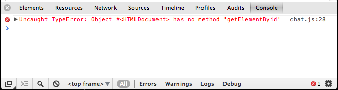
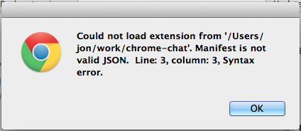
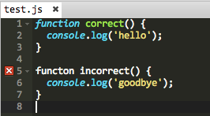

# Help! I'm stuck!

As you are doing your projects, you are bound to spend a lot of time fixing mistakes in your code. This is normal. This guide is an introduction to spotting and fixing mistakes.

## Fixing errors

If there is something going wrong with your code, Chrome will try to tell you by printing our errors and warnings. If you know where to look, these can be very helpful.

### Javascript Console

Chrome has a Javascript console where errors and warnings are displayed. You can access it through the menu options:

	View -> Developer -> Javascript Console

This is an example of what an error looks like the Javascript console:



The console is reporting that there is an error in chat.js on line 28. The error is that we are trying to call a function called `getElementByid`, but the correct name of the function is `getElementById`. Notice that the I didn't capitalize the 'i' in Id correctly. Javascript is sensitive to capitalization, and this is what is causing the error.

### Line numbers

Usually an error will contain a relevant line number and file name. Usually the error will be on this line, but not always. Sometimes an error in an earlier piece of your code will trigger an error in a later part. For example, I received this error when trying to load my Chrome extension.



and here is the beginning of my manifest:

``` javascript
{
  "name": "My Chat Room"
  "description": "This app lets you chat with other people.",
  "version": "1.0",
```

The end of each line in the manifest file needs to end with a comma. Notice that I forgot a comma on line 2. This is the cause of the error, even though Chrome is reporting the error on line 3.

### Slimtext warning

The slimtext text editor will give you warnings are you are typing. These warnings show up to the left of your code.



In this example, slimtext is warning us that we have mispelled the world `funtion` on line 5.

Slimtext will also apply colors to your code as you type it. You can use these colors are cues to find mistakes. Notice how slimtext applies a different color formatting to the world `function` on line 1 versus the incorrectly spelled `functon` on line 5.

### What does an error mean?

Over time, you will get better at understanding what the computer is trying to tell you in its error messages. In the beginning, however, it can be confusing and frustrating.

If you cannot understand the meaning if an error, copy and paste it into Google. Google can be your best friend when you are coding.

Remember, at this stage there is no problem you will run into that hasn't already been solved by thousands of other people. The answers are all on the Internet. Keep googling!

### What if there are no errors?

Sometimes the computer will not generate any errors, but it still won't do what you want. If this happens, you can generate your own messages into the Javascript Console to help you figure out what is broken. To do this, use the `console.log` function.

For example:

```javascript
console.log('Hello 1');

document.addEventListener('DMContentLoaded', function() {
	console.log('Hello 2')

	// more setup goes here..
});

```

When I run this, I will see the following output in my Javascript console:

```
Hello 1
```

Since I can see the `Hello 1` line, I know that the first part of my Javascript code is running. But the `Hello 2` line is never displayed in the console. This leads me to believe that there is something wrong on the line above it, on line 3.

Indeed, I have mispelled the event name, `DOMContentLoaded`. I have left out an O. This is the kind of mistake that won't generate an obvious error, so you need to use `console.log` to track it down.